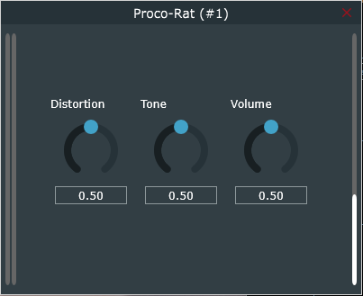

# Proco-Rat

An emulation of Pro Co Rat distortion pedal using nodal analysis. 

Download Windows vst3 files here: [https://github.com/Rudro085/Proco-Rat/releases/tag/v0.1.0](https://github.com/Rudro085/Proco-Rat/releases/tag/v1.0.0)

The circuit schematics of the pedal is based off Electrosmash's analysis here: https://www.electrosmash.com/proco-rat

Each of the components of the circuit schematics has been modelled using nodal analysis to emulate the behaviour of the original hardware.
